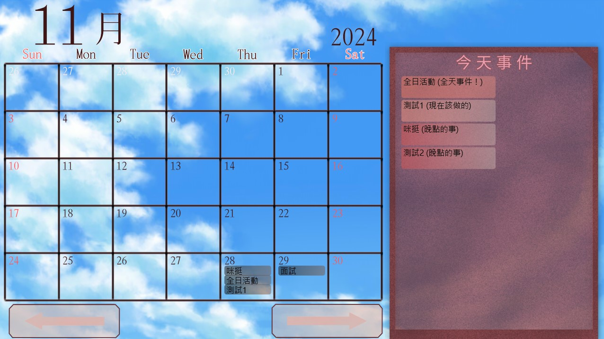
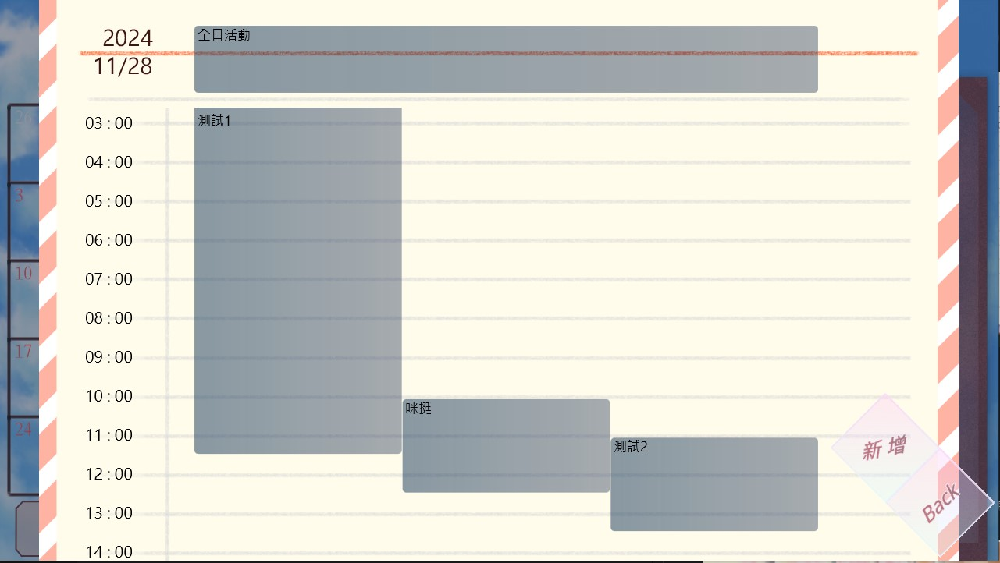
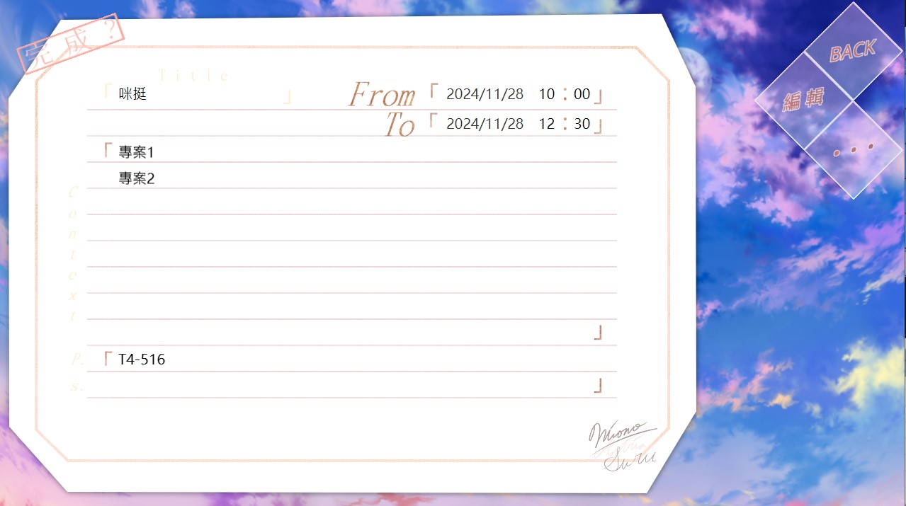
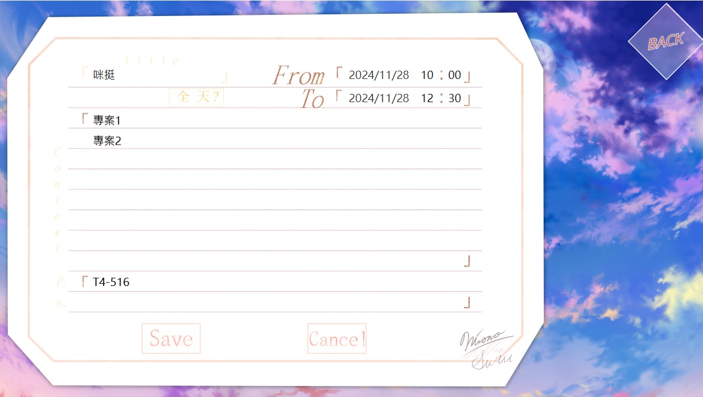

### Windows行事曆、任務記事軟體
- 傳統的行事曆軟體存在難以記錄詳細事件的缺陷
- 這個專案提供了一個整合介面，結合了與2D人物的互動與事件提醒
- 可以執行「project nala.exe」，為打包好的版本

#### 環境需求
- javafx-sdk-16
    - javafx.controls, javafx.media, javafx.fxml
- Java18

### 起始畫面
- 這個畫面並未包含在已打包好的程式中，目前已實現日曆功能
- 可以點選日曆按鈕來進入行事曆功能

### 行事曆
- 整體畫面分為三部分，左側為日曆，右側為今日事件提醒，下方為功能鍵
    - 右側會顯示今天發生的事件，同時計算事件與系統時間的距離，給予不同顏色的背景與提示
    - 下方按鍵為月份切換

#### 日曆
- 均為可點選按鈕，點擊日期將會顯示逐小時的事件列表

    - 上方為全日活動列表，而下方為可滾輪、可拉拖的時間列
    - 將會顯示每個事件的標題，每個方塊皆為可以點選的事件，可以進行查閱與編輯
- 事件

    - 該界面顯示事件的標題、內容與附註
    - 左上角可以將事件切換為完成/未完成，將影響在行事曆頁面的顯示模式
    
    - 鼠標移動至「. . .」按鈕上，將會顯示額外選單，可以進行刪除

##### 事件編輯 / 新增
- 在編輯介面中，可以調整如內容、時間、或是切換為全天任務
    - 點選位於標題下方的「全天？」按鈕即可切換

### 事件儲存
- 事件皆以 json 形式儲存在 data/event 下
- 如果有無法讀取的事件，會被放置於 data/event/brokenFile 下，這時會進行檔名的解密，可以進行修正與恢復
- 為了事件的安全性，關於年份、月份等資訊會被進行簡單加密

### 資源切換
- 位於介面中的所有圖片皆可以替換，位於 resources 下
- 所有的資源都會進行 AES, CBC, PKCS5 加密，並以加密形式進行讀取